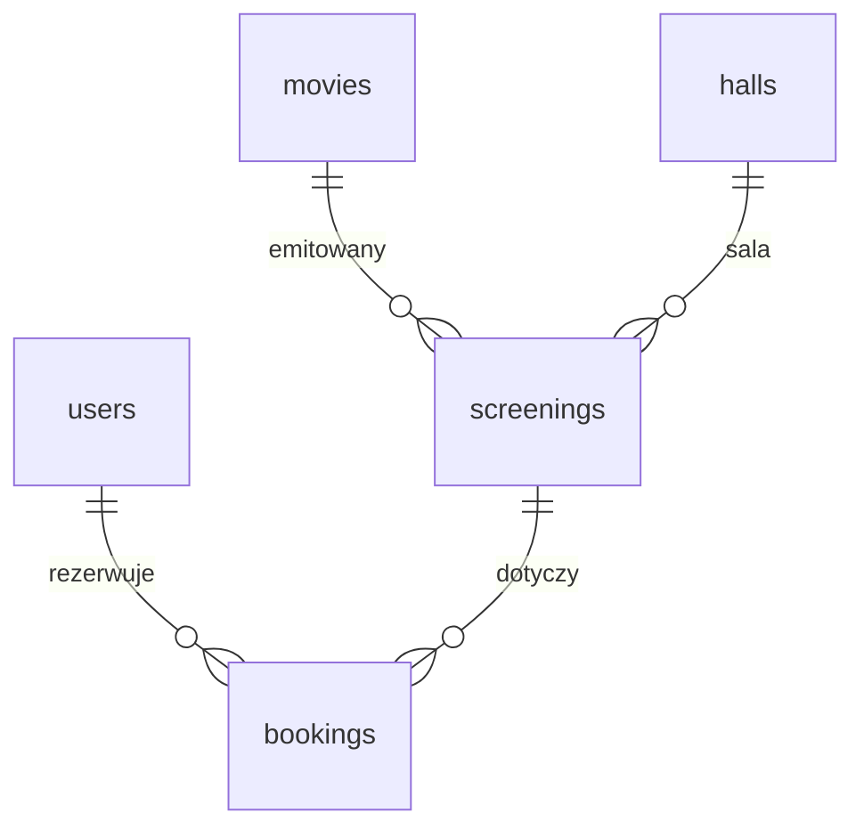

# Baza danych MySQL — CinemaŚty (Sprint: projekt bazy)

**Nazwa bazy:** `cinema_system`  
**Silnik:** InnoDB, zestaw znaków `utf8mb4` (polskie znaki, emoji w treściach).  
**Pełny zrzut (struktura + przykładowe dane):** plik [`CinemaSty_baza.sql`](../CinemaSty_baza.sql) w katalogu głównym projektu.  
**Sama struktura (bez INSERT):** plik [`cinema_system_struktura.sql`](cinema_system_struktura.sql).

---

## 1. Cel modelu

Baza wspiera system kina internetowego: katalog filmów, sale z układem miejsc, harmonogram seansów, konta użytkowników (klient / pracownik / administrator), rezerwacje miejsc oraz prosty cennik zależny od wyprzedzenia względem seansu.

---

## 2. Relacje (schemat logiczny)

Tabela `pricing_rules` nie ma kluczy obcych do powyższych encji — aplikacja traktuje ją jako słownik cen.

---

## 3. Opis tabel

### 3.1. `users`

**Po co jest:** Przechowuje użytkowników systemu i dane do logowania.

| Kolumna | Znaczenie |
|--------|-----------|
| `id` | Identyfikator (klucz główny, AUTO_INCREMENT). |
| `name` | Wyświetlana nazwa / imię. |
| `email` | Adres e-mail (unikalny — logowanie i kontakt). |
| `password_hash` | Skrót hasła (np. bcrypt), nie plain text. |
| `role` | Rola: `user` (klient), `employee` (pracownik), `admin`. |
| `created_at` | Data utworzenia konta. |
| `reset_token` | Token do resetu hasła (opcjonalnie). |
| `reset_token_expires` | Ważność tokenu resetu. |

**Powiązania:** Z tabeli `bookings` przez `user_id` (ON DELETE CASCADE — usunięcie użytkownika usuwa jego rezerwacje).

---

### 3.2. `movies`

**Po co jest:** Katalog filmów pokazywanych w kinie.

| Kolumna | Znaczenie |
|--------|-----------|
| `id` | Identyfikator filmu. |
| `title` | Tytuł. |
| `description` | Opis (może być pusty). |
| `duration` | Czas trwania w minutach (ważne przy planowaniu seansów i kolizjach sal). |
| `release_date` | Początek emisji w kinie. |
| `end_date` | Koniec emisji w kinie. |
| `image_url` | Adres plakatu. |
| `youtube_link` | Link do zwiastuna. |
| `created_at` | Kiedy rekord dodano do bazy. |

**Powiązania:** `screenings.movie_id` → `movies.id` (ON DELETE CASCADE).

---

### 3.3. `halls`

**Po co jest:** Sale kinowe: nazwa, liczba miejsc, geometryczny układ miejsc.

| Kolumna | Znaczenie |
|--------|-----------|
| `id` | Identyfikator sali. |
| `name` | Nazwa sali (np. „Sala 1”). |
| `seats` | Liczba miejsc (zgodna z logiką aplikacji / układem). |
| `layout_data` | JSON (macierz komórek): które pola to miejsca, które przejścia / puste — używane przy wyborze miejsca na planie. |
| `created_at` | Data dodania sali. |

**Powiązania:** `screenings.hall_id` → `halls.id` (ON DELETE CASCADE).

---

### 3.4. `screenings`

**Po co jest:** Konkretny seans: który film, która sala, data i godzina.

| Kolumna | Znaczenie |
|--------|-----------|
| `id` | Identyfikator seansu. |
| `movie_id` | Film (`movies`). |
| `hall_id` | Sala (`halls`). |
| `date` | Dzień seansu. |
| `time` | Godzina rozpoczęcia. |
| `cancelled` | Czy seans anulowany (0/1) — aplikacja może wykluczać takie seanse z repertuaru lub walidacji. |
| `created_at` | Kiedy dodano seans. |

**Powiązania:** Klucze obce do `movies` i `halls`.  
**Z tabeli `bookings`:** `screening_id` → `screenings.id` (ON DELETE CASCADE).

---

### 3.5. `bookings`

**Po co jest:** Pojedyncza rezerwacja / bilet: użytkownik, seans, konkretne miejsce, status płatności / obiegu.

| Kolumna | Znaczenie |
|--------|-----------|
| `id` | Identyfikator rezerwacji. |
| `user_id` | Kto kupił (`users`). |
| `screening_id` | Który seans (`screenings`). |
| `seat_number` | Identyfikator miejsca w układzie sali (np. `R10-S5` — spójny z `layout_data`). |
| `status` | `paid` — opłacone; `booked` — zarezerwowane; `cancelled` — anulowane; `returned` — zwrócone (np. zwrot). |
| `created_at` | Czas utworzenia rekordu. |

**Ograniczenia:** Unikalny klucz `(screening_id, seat_number, status)` — ten sam fotel na tym samym seansie nie powinien mieć dwóch rekordów w tym samym „stanie” biznesowym; różne statusy mogą współistnieć w zależności od wdrożonej logiki (np. historia zwrotu).

---

### 3.6. `pricing_rules`

**Po co jest:** Tabela referencyjna cen w zależności od tego, ile dni przed seansem następuje zakup (lub wyliczenie ceny).

| Kolumna | Znaczenie |
|--------|-----------|
| `days_before` | Liczba dni przed seansem (0 = w dniu seansu, 1 = na dzień przed itd.) — **klucz główny**. |
| `price_base` | Cena bazowa biletu dla tego progu (PLN). |

Aplikacja dobiera wiersz na podstawie różnicy dat między zakupem a datą seansu (wg zaimplementowanej reguły).

---

## 4. Indeksy i integralność (skrót)

- **PK** na wszystkich tabelach z kolumną `id` (lub `days_before` w `pricing_rules`).
- **UNIQUE** na `users.email`.
- **UNIQUE** na `(screening_id, seat_number, status)` w `bookings`.
- **Indeksy** pomocnicze: m.in. `screenings(date)`, `bookings(user_id)`, `bookings(screening_id)` — przyspieszają repertuar, profil użytkownika i listy miejsc.
- **Klucze obce:** `bookings` → `users`, `screenings`; `screenings` → `movies`, `halls` — spójność referencyjna i kaskadowe usuwanie zależnych rekordów.

---

## 5. Uwagi na obronę / dokument sprintu

- Model jest **znormalizowany** w obszarze seansów i rezerwacji (film i sala nie są duplikowane w `screenings`).
- **JSON** w `halls.layout_data` wymaga poprawnej treści JSON po stronie aplikacji.
- Enum **ról** i **statusów rezerwacji** ogranicza dopuszczalne wartości w bazie i ułatwia walidację.
